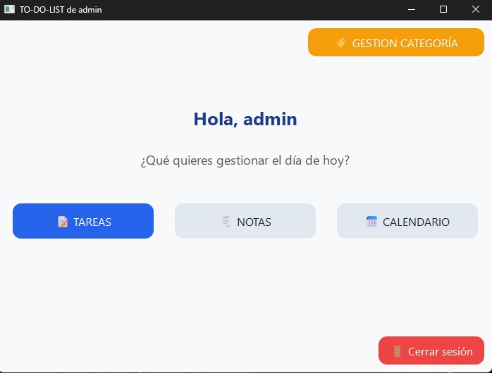

# ✅ TO-DO-LIST

Aplicación de escritorio desarrollada en **Python** con **PyQt6**, que permite a los usuarios **crear y gestionar tareas, notas, categorías y calendario** de forma organizada y personalizada mediante una cuenta de acceso individual.

---

## 📌 Características principales

- 🔐 **Login por usuario:** Cada usuario tiene su cuenta y ve únicamente sus tareas.
- ✅ **Gestión de tareas:** Agregar, editar, eliminar, completar y categorizar tareas.
- 🗂️ **Gestión de categorías:** Crea tus propias categorías personalizadas.
- 🗒️ **Notas personales:** Crea, edita, borra y marca notas como favoritas.
- 📅 **Calendario integrado:** Visualiza tus tareas con fecha límite en vista calendario.
- 🎨 **Interfaz amigable y responsiva** con diseño intuitivo usando PyQt6.
- 🗄️ **Persistencia en SQLite3** con relaciones y claves foráneas activadas.
- 🔐 **Contraseñas encriptadas** usando SHA-256.

---

## 🧠 Modelo de datos

### 📦 Clases modelo

| Clase     | Atributos destacados |
|-----------|----------------------|
| `Usuario` | `id`, `nombre_usuario`, `contraseña` (encriptada) |
| `Tarea`   | `id`, `descripcion`, `estado`, `fecha_limite`, `categoria_id`, `usuario_id` |
| `Nota`    | `id`, `titulo`, `contenido`, `estadoFavorito`, `usuario_id` |
| `Categoria` | `id`, `nombre`, `usuario_id` |

Las clases están completamente encapsuladas en objetos, promoviendo una estructura clara y reutilizable.

---

## 🧰 Estructura del proyecto

```

TO-DO-LIST/
│
├── app.py                         # Punto de entrada de la app
├── src/
│   ├── modelos/                   # Clases: Usuario, Tarea, Nota, Categoria
│   ├── gestores/                  # Gestores: Usuarios, Tareas, Categorías, Notas
│   ├── db/
│   │   └── init\_db.py             # Inicializador de base de datos
│   └── ui/                        # Interfaz: Ventanas (login, main, tareas, etc.)
└── README.md

````

---

## 🗃️ Base de datos

**SQLite3**, con las siguientes tablas y relaciones:

- `usuarios`: guarda nombre y contraseña (único).
- `tareas`: vinculadas a `usuarios` y opcionalmente a `categorias`.
- `categorias`: relacionadas con `usuarios`.
- `notas`: vinculadas a `usuarios`.

Todas las **claves foráneas** están activadas para mantener integridad referencial.

---

## 🔑 Seguridad

- Las contraseñas se encriptan con `SHA-256` al momento del registro.
- No se almacenan contraseñas en texto plano.

---

## 🛠 Instalación de dependencias

Este proyecto requiere [Python 3.10+](https://www.python.org/downloads/) y la biblioteca **PyQt6**. Puedes instalar todas las dependencias necesarias ejecutando:

```bash
pip install -r requirements.txt
```

> ⚠️ Asegúrate de estar en el entorno virtual correcto antes de ejecutar el comando.

---

### 📌 Verificar la versión de PyQt6

Para comprobar qué versión de PyQt6 tienes instalada, ejecuta el siguiente comando en tu terminal:

```bash
pip show PyQt6
```

También puedes verificarlo desde Python con:

```python
import PyQt6
print(PyQt6.__version__)
```

---
### 📌 Ejecutar

```bash
python app.py
```

---

## 🛠️ Funcionalidades por archivo

| Módulo            | Funcionalidades clave                                |
| ----------------- | ---------------------------------------------------- |
| `GestorUsuarios`  | Registro, login, encriptación                        |
| `GestorTareas`    | CRUD tareas, cambio estado, filtrado por categoría   |
| `GestorNotas`     | CRUD notas, favoritos                                |
| `GestorCategoria` | CRUD categorías, obtener tareas por categoría        |
| `MainWindow`      | Centro de navegación entre tareas, notas, calendario |
| `WindowLogin`     | Validación de usuario y acceso seguro                |
| `init_db.py`      | Inicializa todas las tablas necesarias               |

---

## 🚀 Futuras mejoras

* 📱 Versión móvil con Kivy o Flutter.
* 🌐 Sincronización en la nube (Firebase o backend personalizado).
* 🔔 Notificaciones de recordatorio de tareas.
* 📊 Dashboard de productividad.
* 🧪 Pruebas automatizadas con `unittest`.

---

## 👨‍💻 Desarrollado por

| Nombre completo                   | Rol               |
|-----------------------------------|-------------------|
| Landa Rojas Alexander Nelson      | Desarrollador     |
| Arce Curi Rodrigo Vladimir        | Desarrollador     |
| Gamarra Curi Gianmarco            | Desarrollador     |
| Gutierrez Taipe Luis Alberto      | Desarrollador     |
| Salvador Rivera Bruce Joshua      | Desarrollador     |
| Tucto Ubaldo Ricardo David        | Desarrollador     |

---

## 🧪 Ejemplo visual

 <!-- Si algún día tienes una imagen -->

